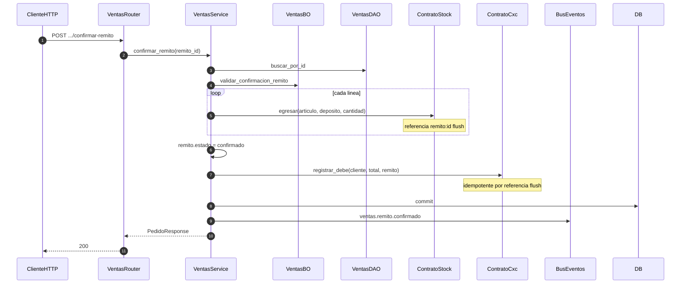

# ventas — confirmar remito (stock + CxC)

Prefijo: `/api/v1/ventas`. Módulos HTTP: `mostrador` o `ventas`.
Fuentes: `app/modulos/ventas/{router,service,bo,dao,contrato,eventos}.py`.

## POST /ventas/pedidos/{id}/confirmar-remito (`operation_id`: `confirmar_remito`)

## Otros flujos

| operation_id | Resumen |
|--------------|---------|
| `crear_pedido` | Valida cliente/producto, resuelve precio, IVA, talonario, commit, evento `ventas.{tipo}.creado` |
| `facturar_remito` | Remito confirmado → factura; CxC solo si el remito no tenía debe; evento `ventas.factura.creada` |
| `cambiar_estado_pedido` | Transición BO; remito→confirmado redirige a `confirmar_remito` |

Usa: `ContratoClientes`, `ContratoProductos`, `ContratoPrecios`, `ContratoStock`, `ContratoParametros`, `ContratoCxc`.
Expone: `ContratoVentas`.
Publica: `ventas.{tipo}.creado`, `ventas.{tipo}.estado_cambiado`, `ventas.remito.confirmado`, `ventas.factura.creada`.
