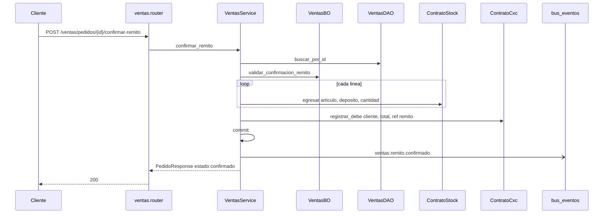
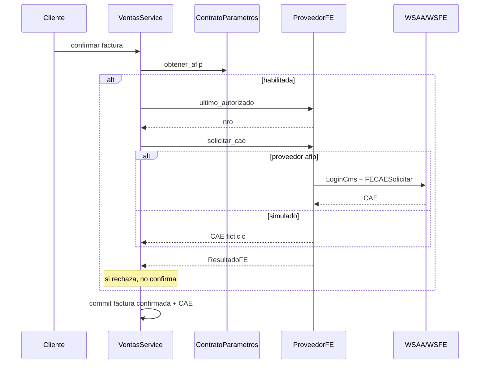

# ventas — confirmar remito

Fuente: `app/modulos/ventas/` · Flujo principal: `POST /api/v1/ventas/pedidos/{id}/confirmar-remito`.
Actualizado: 2026-08-29.

Egreso de stock + debe en CxC en la **misma transacción**. Luego publica `ventas.remito.confirmado` (hooks locales no-op; otros módulos pueden suscribirse).

## Crear comprobante (contexto)

`POST /ventas/pedidos`: valida cliente, arma líneas con `ContratoProductos` + `ContratoPrecios`, IVA y número de `ContratoParametros`, commit, evento `ventas.{tipo}.creado`.

Facturar remito (`POST .../facturar`): si el remito **ya** tiene movimiento CxC, no vuelve a imputar. Evento `ventas.factura.creada`. Si ARCA está habilitada, pide CAE antes de confirmar.

## Factura fiscal (ARCA / WSFE)

Al confirmar una factura (`PATCH .../estado` o `POST .../facturar`) con `afip_habilitada`:

## Otros endpoints

| Método | Ruta | operation_id |
|--------|------|----------------|
| GET | `/ventas/pedidos` | `listar_pedidos` |
| GET | `/ventas/pedidos/{id}` | `obtener_pedido` |
| POST | `/ventas/pedidos` | `crear_pedido` |
| PATCH | `/ventas/pedidos/{id}/estado` | `cambiar_estado_pedido` |
| POST | `/ventas/pedidos/{id}/facturar` | `facturar_remito` |

## Contrato público

`ContratoVentas`: métricas, pendientes, top artículos, `obtener_comprobante_cobrable`. Usado por **reporteria** y **cobranzas**.
