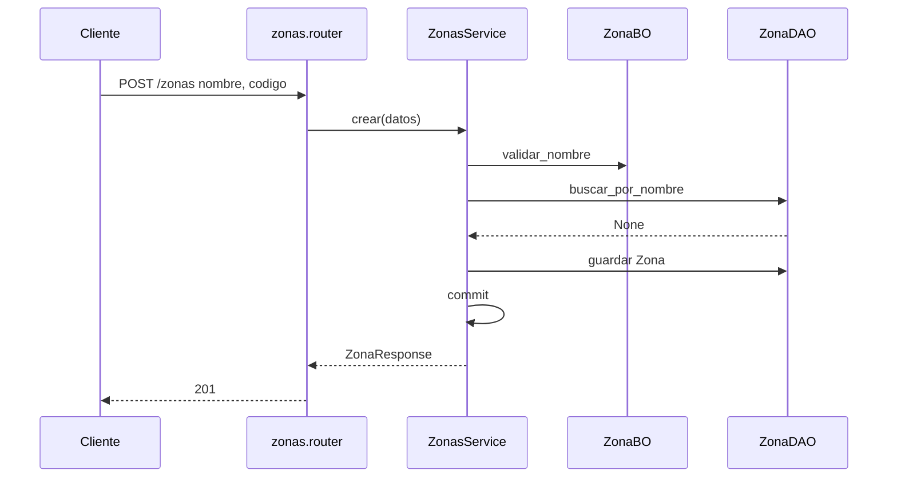

# zonas — alta

Fuente: `app/modulos/zonas/` · Flujo principal: `POST /api/v1/zonas`.
Actualizado: 2026-09-23.

Catálogo simple: nombre único, código. Sin contratos de entrada; expone `existe_zona` a clientes.

## Otros endpoints

| Método | Ruta | operation_id |
|--------|------|----------------|
| GET | `/zonas` | `listar_zonas` (paginado; `q`, `activo`) |
| GET | `/zonas/{id}` | `obtener_zona` |
| POST | `/zonas` | `crear_zona` |
| PUT | `/zonas/{id}` | `actualizar_zona` |
| PATCH | `/zonas/{id}/desactivar` | `desactivar_zona` |

## Contrato público

`ContratoZonas.existe_zona`. Usado por **clientes**.
