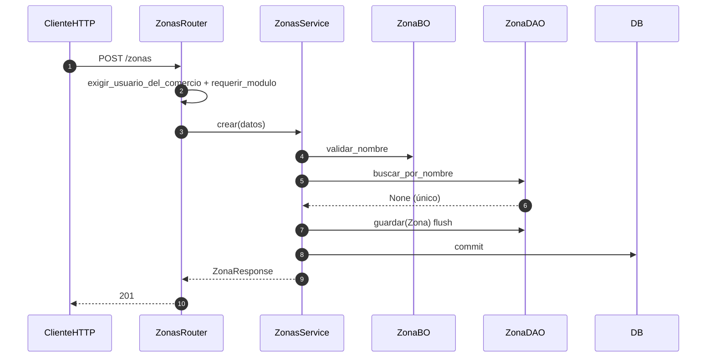

# zonas — alta de zona

Prefijo: `/api/v1/zonas`. Módulos HTTP: `clientes` o `configuracion`.
Fuentes: `app/modulos/zonas/{router,service,bo,dao,contrato}.py`.

## POST /zonas (`operation_id`: `crear_zona`)

Sin contratos entrantes. Expone `ContratoZonas.existe_zona` (usado por clientes).
