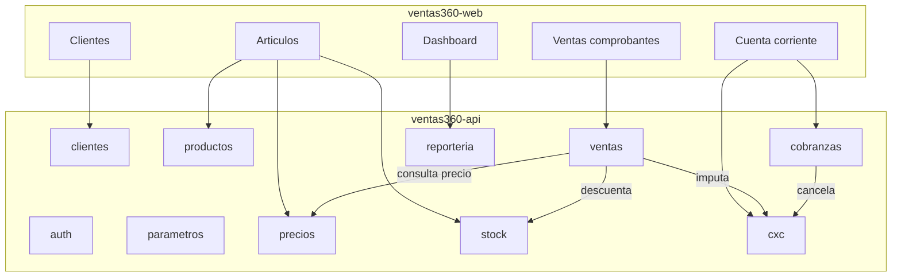

# Fase A — Modernización WinSales → Ventas360

Plan de implementación del **núcleo comercial** sobre el scaffold actual de Ventas360 (API + Web), alineado al análisis de `WINSALES.mdb` y a la [validación de módulos](./winsales-validacion-modulos.md).

## Objetivo

Cubrir el ~80 % del uso real de WinSales en esta base:

`Cliente + Artículo + Precio → Remito → Factura → Cobranza (CxC)` + stock multi-depósito + KPIs.

Fuera de Fase A: OC, contabilidad, taller, mensajería, AFIP completo, logística avanzada.

## Estado actual del scaffold

| Área | API (`ventas360-api`) | Web (`ventas360-web`) | Gap vs WinSales |
|------|----------------------|------------------------|-----------------|
| Auth | Login JWT, roles admin/vendedor | Login + shell | Permisos finos (después) |
| Parámetros | Módulo básico | Configuración perfil | Sucursales, numeradores, condiciones |
| Clientes | CRUD + desactivar | Listado + modal config | Fiscal, crédito, zona, vendedor |
| Productos | CRUD sku/precio/stock | Listado + modal | Marca, rubro, multi-depósito, código barras |
| Ventas | Pedidos simples (`borrador…`) | Pedidos + estados | **Remitos, facturas, conversión** |
| CxC / cobranzas | — | — | **Nuevo** |
| Listas / remarcación | — | — | **Nuevo** |
| Stock depósitos | Stock plano en producto | — | **Nuevo** |
| Reportería | KPIs stub | Dashboard demo | Conectar a datos reales |

## Principios de diseño (obligatorios API)

- Un módulo = un paquete en `app/modulos/<nombre>/` con `router → service → bo + dao + models + schemas` (+ `contrato.py`).
- Sin ForeignKey cross-módulo; IDs débiles + validación por contrato.
- Prefijo de tablas: `clientes_`, `productos_`, `ventas_`, `stock_`, `precios_`, `cxc_`, etc.
- Commit solo en service; BO puro; eventos `modulo.entidad.accion` para efectos entre módulos.
- Catálogo grande (~200k SKUs): listados con **paginación + búsqueda** desde el primer endpoint de artículos.

## Arquitectura objetivo Fase A

## Alcance por módulo (Fase A)

### A1. Ampliar `clientes`
- Campos: CUIT, condición IVA, límite crédito, zona_id, vendedor_id, bloqueo, observaciones.
- Endpoints: mantener listado paginado `?q=&activo=&page=`.
- Web: columnas y formulario en modal de configuración.

### A2. Ampliar `productos` (artículos)
- Campos: marca, rubro, codigo_barras, costo, precio_lista, moneda_id (opcional), activo.
- Búsqueda por SKU/descripción/código barras; paginación obligatoria.
- Web: filtros + tabla performante (virtualización o server-side page).

### A3. Nuevo módulo `precios`
- Listas simples + remarcación por artículo (o % sobre costo).
- Contrato: `obtener_precio(cliente_id, articulo_id) -> decimal`.
- Ventas consume el contrato; no duplicar lógica en el front.

### A4. Nuevo módulo `stock`
- Depósitos; saldo `articulo_id + deposito_id`.
- Movimientos: ajuste, egreso por remito/factura, ingreso (stub Fase B compras).
- Evento: `ventas.remito.confirmado` → descuenta stock.
- Web: saldos por depósito en config del artículo; pantalla ajustes admin.

### A5. Evolucionar `ventas` (comprobantes tipados)
- Tipos: `presupuesto | pedido | remito | factura` (pedido opcional; remito + factura son el MVP).
- Modelo cabecera + líneas; estados por tipo; conversión `remito → factura`.
- Snapshot de precio/cantidad; totales neto/IVA/total (IVA simplificado al inicio).
- Campos AFIP (CAE) como opcionales nullable — sin integración real en Fase A.
- Deprecar o mapear el “pedido” actual a `tipo=pedido` para no romper el scaffold.

### A6. Nuevo módulo `cxc`
- Movimientos de cuenta corriente cliente (debe/haber) generados por factura y recibo.
- Consulta estado de cuenta y saldo.
- Contrato usado por ventas y cobranzas.

### A7. Nuevo módulo `cobranzas`
- Recibos de cliente: medios (efectivo/transferencia/tarjeta stub), imputación a facturas.
- Impacta `cxc` y opcionalmente caja (caja completa = Fase B).

### A8. `parametros` mínimos
- Condiciones de pago, tipos de comprobante, numeradores (talonarios).
- Sucursal default única si aún no hay multi-sucursal.

### A9. `reporteria`
- KPIs reales: ventas del día/mes, pedidos/remitos pendientes, clientes activos, top artículos.
- Web: dashboard con `app-kpi-card` (sin números hardcodeados).

## Orden de implementación sugerido

1. **API A1–A2** (clientes/artículos enriquecidos + paginación).  
2. **API A4 stock** (depósitos + saldos) y **A3 precios** (contrato).  
3. **API A5 ventas** remito/factura + eventos a stock.  
4. **API A6–A7** cxc + cobranzas.  
5. **API A8–A9** parámetros/numeradores + KPIs.  
6. **Web** pantallas en el mismo orden, reutilizando UI kit Agro360 (tabla, modal config, state-wrapper).

## Progreso de implementación

| Slice | Estado |
|-------|--------|
| A1 clientes enriquecidos + paginación | Hecho (API + web) |
| A2 artículos enriquecidos + paginación | Hecho (API + web; seed ~54 SKUs) |
| A3 precios (listas + contrato) | Hecho (API base) |
| A4 stock multi-depósito | Hecho (API base: depósitos/saldos/ajustes) |
| A5 remitos/facturas tipados | Hecho (API + web: confirmar remito→stock, facturar) |
| A6–A7 cxc + cobranzas | Hecho (API + web cuenta corriente/recibos) |
| A8–A9 parámetros/reportería | Hecho (talonarios/sucursal + KPIs dashboard) |

## Criterios de aceptación Fase A

- [x] Listar/buscar artículos con paginación (seed demo ampliado; 10k queda para ETL).  
- [x] Crear remito que descuente stock de un depósito.  
- [x] Convertir remito en factura e imputar CxC.  
- [x] Registrar recibo que reduzca saldo CxC.  
- [x] Dashboard con KPIs desde `/reporteria/kpis`.  
- [x] Sin módulos de contabilidad, OC ni taller.

## Fuera de alcance (explícito)

- AFIP WSAA/WSFE real (solo campos placeholder).  
- Compras / OC / proveedores avanzados.  
- Contabilidad y centros de costo.  
- Taller, turnos, colocaciones.  
- Hoja de ruta / choferes.  
- Mensajería interna.  
- Migración automática desde el `.mdb` (será un proyecto aparte de ETL).

## Próximo paso operativo

Cuando se apruebe ejecutar Fase A: abrir issues/PRs por slice vertical (ej. “stock multi-depósito”, “remitos”, “cxc+recibos”) empezando por paginación de artículos y modelo de comprobantes tipados en `app/modulos/ventas`.
